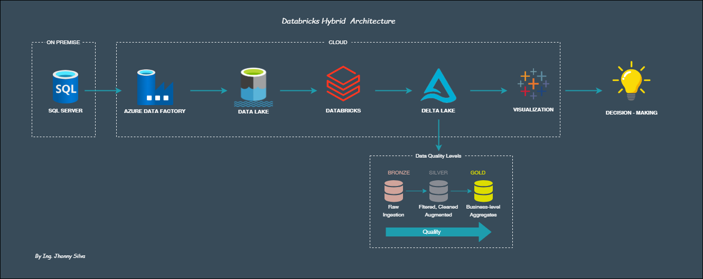

# Databricks Hybrid DWH Architecture
This repository contains data architecture diagrams designed in [draw.io](https://app.diagrams.net) for analytics projects. It includes on-premise, cloud, and hybrid ETL flows from SQL Server to a Data Lake in Azure Databricks and DWH, integrated with Tableau for scalable visualization.

## Contents
- **architecture/databricks-hybrid-dwh-architecture.drawio**: Hybrid architecture diagram illustrating an ETL pipeline from SQL Server to Delta Lake and a data warehouse, with data visualization in Tableau.

## How to Use
1. Download the `.drawio` file.
2. Open it in [draw.io](https://app.diagrams.net).

## Technologies
- SQL Server, Azure Data Factory, Data Lake, Azure Databricks, Delta Lake, ETL, DWH, Tableau.

## Preview

## Contact
Connect with me on [LinkedIn](https://www.linkedin.com/in/jhonny-silva-681149114) for more data projects.

#DataEngineering #DataAnalytics #Tableau #SQL #AzureDataFactory #DataLake #Databricks #DeltaLake #DataWarehouse #DataDriven

